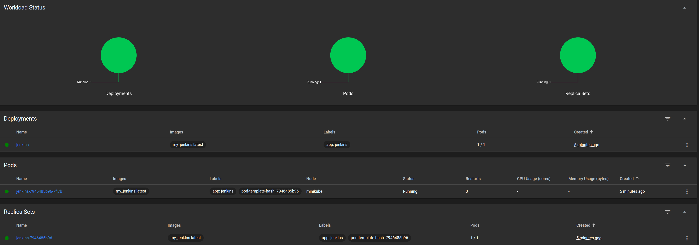
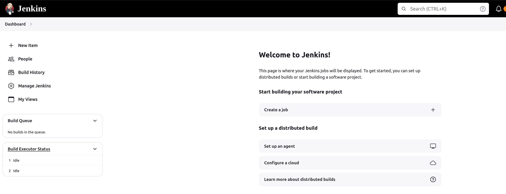
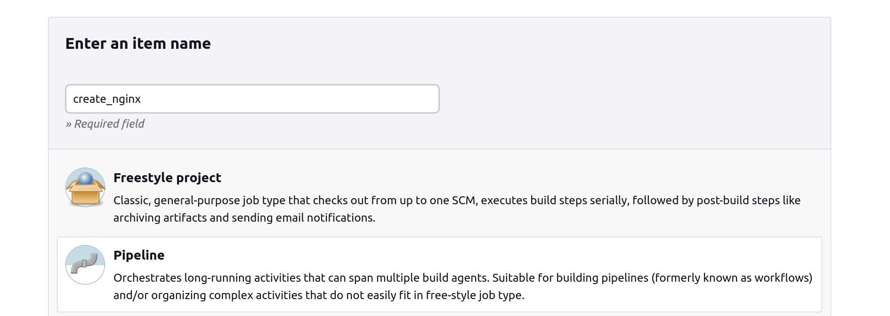
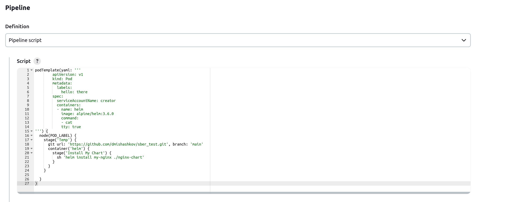

# Тестовое задание Sber DevOps Шашков Дмитрий Дмитриевич

Задание было выполнено на Ubuntu 22.04, используя minikube, docker, kubectl   
Все команды нужно выполнять из корня репозитория.  
Helm чарт находится в папке nginx-chart

<details> <summary> Установка minikube, docker и kubectl </summary>

### Установка при помощи скрипта
Установить все программы можно следующей командой или мануально.  
Установка при помощи скрипта:
```
sudo chmod +x install.sh
./install.sh
```

### Установка Docker  
Добавим репозиторий Docker:  
```
sudo apt-get update
sudo apt-get install ca-certificates curl
sudo install -m 0755 -d /etc/apt/keyrings
sudo curl -fsSL https://download.docker.com/linux/ubuntu/gpg -o /etc/apt/keyrings/docker.asc
sudo chmod a+r /etc/apt/keyrings/docker.asc
echo \
  "deb [arch=$(dpkg --print-architecture) signed-by=/etc/apt/keyrings/docker.asc] https://download.docker.com/linux/ubuntu \
  $(. /etc/os-release && echo "$VERSION_CODENAME") stable" | \
  sudo tee /etc/apt/sources.list.d/docker.list > /dev/null
sudo apt-get update
```
Установим Docker:
```
sudo apt-get install docker-ce docker-ce-cli containerd.io docker-buildx-plugin docker-compose-plugin
```

### Установка Minikube  

Скачаем Minikube и переместим его в директорию `/usr/local/bin/`:
```
curl -Lo minikube https://storage.googleapis.com/minikube/releases/latest/minikube-linux-amd64 \
  && chmod +x minikube
sudo mkdir -p /usr/local/bin/
sudo install minikube /usr/local/bin/
```

### Установка Kubectl  

Добавим репозиторий kubectl и установим программу:
```
sudo apt-get update && sudo apt-get install -y apt-transport-https
curl -s https://packages.cloud.google.com/apt/doc/apt-key.gpg | sudo apt-key add -
echo "deb https://apt.kubernetes.io/ kubernetes-xenial main" | sudo tee -a /etc/apt/sources.list.d/kubernetes.list
sudo apt-get update
sudo apt-get install -y kubectl
```


</details>

<details> <summary> Поднятие Jenkins </summary>

Сначала запустим сам Minikube:
```
minikube start --driver='docker'
```

Запустим скрипт deploy.sh, который задеплоит Jenkins в minikube (может работать до 5 минут, т.к. копирует image в minikube):

```
sudo chmod +x deploy.sh
./deploy.sh
```

Запустим команду, которая откроет dashboard minikube в браузере:
```
minikube dashboard
```
Видим, что Jenkins задеплоился:
 

Так как команда `minikube dashboard` блокирует терминал, то для дальнейшей работы понадобится ещё один терминал. Можно убить команду используя 
`CTRL + C` в терминале, если dashboard не нужен.

Теперь чтобы подключиться к Jenkins нам нужен пароль от пользователя admin и сам IP адрес Jenkins, чтобы настроить его для работы с Kubernetes.
Сначала найдём пароль, который нам сгенерировал Jenkins. Он лежит в `/var/jenkins_home/secrets/initialAdminPassword` Для этого нам нужно получить название пода и вывести содержимое файла по указанному пути. Во второй команде нужно указать название контейнера, которое вывела первая команда (поле NAME):
```
kubectl get pods
NAME                       READY   STATUS    RESTARTS   AGE
jenkins-7946485b96-7fl7b   1/1     Running   0          23m
kubectl exec --stdin --tty jenkins-7946485b96-7fl7b -- /bin/bash
jenkins@jenkins-7946485b96-7fl7b:/$ cat /var/jenkins_home/secrets/initialAdminPassword
1f03a2a254d347a68306af464245203f
jenkins@jenkins-7946485b96-7fl7b:/$ exit
exit
```
Для получения IP достаточно узнать адрес, на котором работает нода minikube, т.к. порт при деплое был указан как равный `31600`:
```
minikube ip
192.168.49.2
```
Значит к Jenkins можно подключиться по адресу `192.168.49.2:31600`. Подключаемся, используя пароль, который мы получили на предыдущем шаге, логин - admim (при последующих подключениях):
  

</details>

<details> <summary>Настройка Jenkins для создания агентов в Kubernetes </summary>
Настроим Kubernetes Cloud в Jenkins чтобы можно было использовать Kubernetes агентов

Перейдем в Dashboard->Manage Jenkins->Clouds->New cloud и создадим облако, например kubernetes (тип облака ставим Kubernetes)  
Нужно заполнить поле Kubernetes URL и Jenkins URL. Kubernetes URL берём из следующей команды:
```
kubectl cluster-info
Kubernetes control plane is running at https://192.168.49.2:8443
CoreDNS is running at https://192.168.49.2:8443/api/v1/namespaces/kube-system/services/kube-dns:dns/proxy

```
Kubernetes URL в данном случае равен `https://192.168.49.2:8443` (Kubernetes control plane)
Jenkins URL получаем следующим образом (id пода мы знаем из предыдущих шагов):
```
kubectl describe pod jenkins-7946485b96-7fl7b | grep "IP:" | head -n 1
IP:               10.244.0.5

```
Jenkins URL в данном случае равен  `http://10.244.0.5:8080`, т.к. порт стандартный — 8080.


</details>

<details> <summary>Создание Job для установки nginx на кластер</summary>
Создаём Job типа Pipeline:



Создаем pipeline с кодом из файла Jenkinsfile и запускаем pipeline:
  
  

Убеждаемся что nginx доступен на порту 32080 ноды kubernetes (IP ноды можно узнать используя команду `minikube ip`):
```
curl http://192.168.49.2:32080
<!DOCTYPE html>
<html>
<head>
<title>Welcome to nginx!</title>
<style>
html { color-scheme: light dark; }
body { width: 35em; margin: 0 auto;
font-family: Tahoma, Verdana, Arial, sans-serif; }
</style>
</head>
<body>
<h1>Welcome to nginx!</h1>
<p>If you see this page, the nginx web server is successfully installed and
working. Further configuration is required.</p>

<p>For online documentation and support please refer to
<a href="http://nginx.org/">nginx.org</a>.<br/>
Commercial support is available at
<a href="http://nginx.com/">nginx.com</a>.</p>

<p><em>Thank you for using nginx.</em></p>
</body>
</html>
```


</details>
